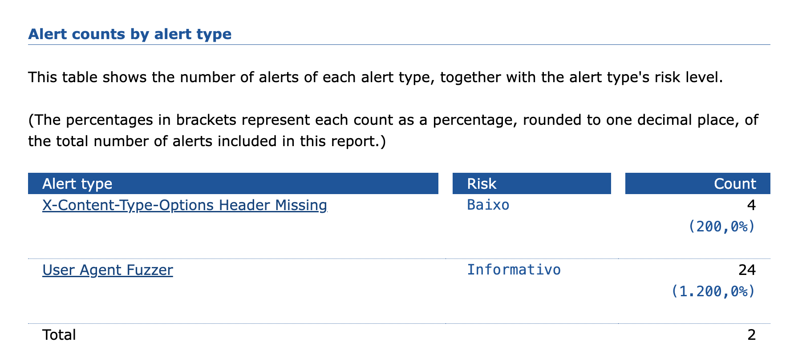

## Relatório de Vulnerabilidades

Relatório de vulnerabilidades gerado pelo OWASP ZAP (Zed Attack Proxy).

Analisados os seguintes endpoints:

<b>Listar/exibir cardápio:</b>
```
curl --location 'http://{{host}}:{{port}}/items'
```

<b>Geração do Pagamento:</b>
```
curl --location 'http://{{host}}:{{port}}/pagamentos/d0c94a28-c47f-46d8-8d52-42b9b6133cca/qr-code'
```


<b>Confirmação do Pagamento (Webhook):</b>
```
curl --location 'http://{{host}}:{{port}}/pagamentos/mp-webhook' \
--header 'Content-Type: application/json' \
--data '{
    "id": 1,
    "live_mode": true,
    "type": "payment",
    "date_created": "2015-03-25T10:04:58.396-04:00",
    "user_id": 44444,
    "api_version": "v1",
    "action": "payment.created",
    "data": {
        "id": "1"
    }
}'
```

<b>Realização do pedido (checkout):</b>
```
curl --location 'http://{{host}}:{{port}}/pedidos' \
--header 'Content-Type: application/json' \
--data '{
    "order_id": "1",
    "client_id": "1234",
    "status": "CRIADO",
    "notes": "notes 1",
    "ordered_items": [
        {
            "item_id": "1",
            "quantity": 2
        },
        {
            "item_id": "3",
            "quantity": 10
        }
    ]
}'
```

## Vulnerabilidades Identificadas

Relatório completo: vulnerabilities-found/ZAP Scanning Report.html



## Vulnerabilidades Mitigadas

Relatório completo: mitigated-vulnerabilities/ZAP Scanning Report.html


## Relatório Completo

- Vulnerabilidades identificadas: vulnerabilities-found/ZAP Scanning Report.html
- Vulnerabilidades mitigadas: mitigated-vulnerabilities/ZAP Scanning Report.html